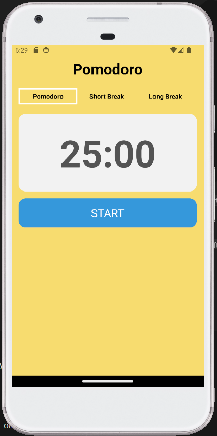

# Pomodoro App

Esta es una aplicación Pomodoro simple construida con React Native.

## Características

- Temporizador Pomodoro con opciones de trabajo y descanso.
- Sonido de notificación cuando se completa un ciclo de trabajo o descanso.
- Cambio de temporizador Pomodoro, descanso corto y descanso largo.
- Diseño atractivo con colores que representan diferentes estados.

## Capturas de Pantalla

## Uso

1. Clona el repositorio a tu máquina local.
2. Asegúrate de tener Node.js y npm instalados en tu sistema.
3. Instala las dependencias con el siguiente comando:
    npm install
4. Inicia la aplicación con el siguiente comando:
    npm start

5. Escanea el código QR generado con la aplicación Expo Go en tu dispositivo móvil o inicia un emulador de Android o iOS para ver la aplicación en acción.

## Tecnologías Utilizadas

- React Native
- Expo
- Expo AV (para el sonido)

